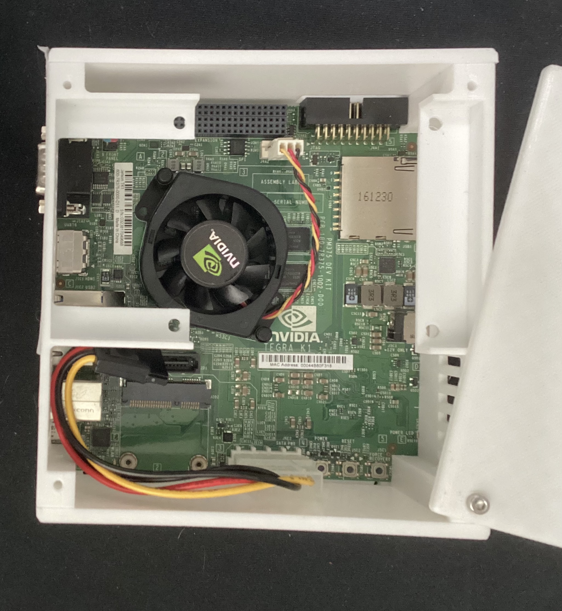

# Overview

First, I have attached an image of the board below.

{width=500}

At the time this little board pushed a full desktop architecture for its GPU. [@TegraWhitePapers]

* Tegra K1
    - Cortex A15 4-PLUS-1 processor
    - Keplar GPU with 192 Cuda cores 
    - 2 GB ram
    - Support for opengl 4.4
    - Support for CUDA 6.6
    - Support for DirectX 11

# Gaming 
Nvidia with this board claimed it was more powerful than the xbox360 and ps3(without accounting for spus) [see @TegraWhitePages pp. 15]. I would like to test this claim; I will account for the overhead in processing for arm and linux compatibility from windows titles.
